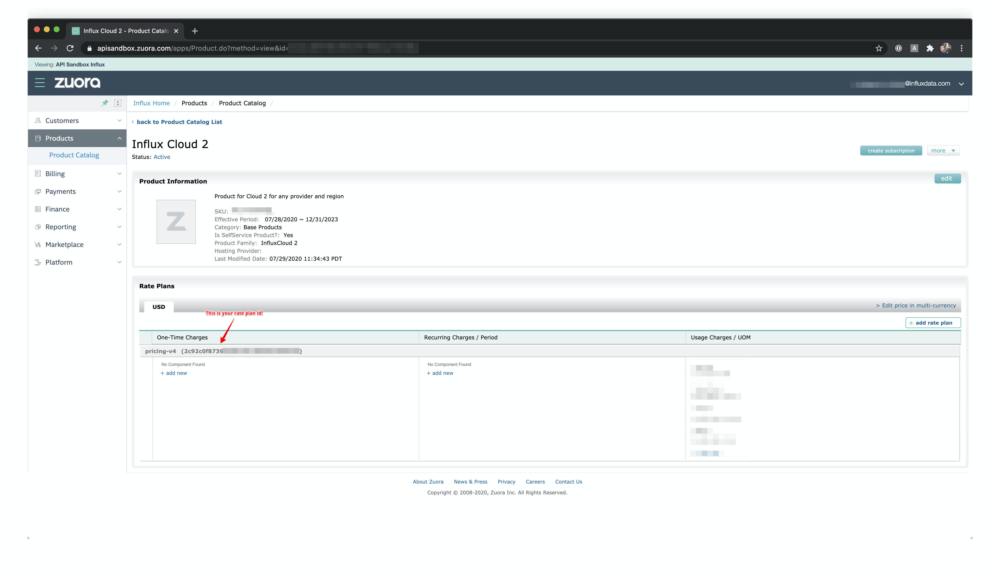

# Zuora Rate Plan ID Display

Currently the rate plan ID isn't displayed on the product page, so you have to inspect the DOM in order to find it. That's pretty silly! This chrome extension finds the element containing the correct ID and adds it next to the title.

## Installation Instructions